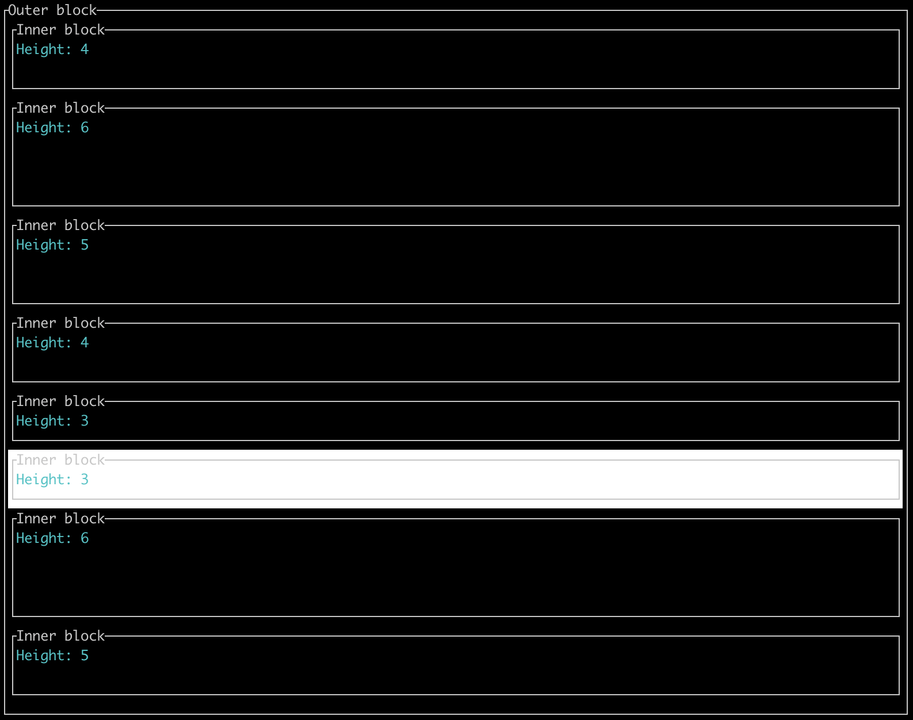

## Widget list implementation for TUI/Ratatui


[Ratatui](https://github.com/tui-rs-revival/ratatui) is a UI Framework to build terminal user interfaces. Ratatui itself provides
some base widgets such as a list of Texts.

This library provides an extension to render a list of arbitrary widgets.


### Documentation

The documentation can be found on [docs.rs.](https://docs.rs/tui-widget-list)

### Demo
Simple List, similar to TUIs List widget
```
cargo run --example simple_list
```

List with differently sized Paragraphs
```
cargo run --example paragraph_list
```

### Usage
Items of [`WidgetList`] or of the convenience class [`SelectableWidgetList`]
must implement the [`ListableWidget`] trait. Then the render() method is available
on the widget list.

```rust
use ratatui::buffer::Buffer;
use ratatui::layout::Rect;
use ratatui::style::{Color, Style};
use ratatui::text::Text;
use ratatui::widgets::{Paragraph, Widget};
use tui_widget_list::{ListableWidget, SelectableWidgetList};

#[derive(Debug, Clone)]
pub struct MyWidgetItem<'a> {
    item: Paragraph<'a>,
    height: u16,
}

impl MyWidgetItem<'_> {
    pub fn new(text: &'static str, height: u16) -> Self {
        let item = Paragraph::new(Text::from(text));
        Self { item, height }
    }

    // Render the item differently depending on the selection state
    fn modify_fn(mut slf: Self, is_selected: Option<bool>) -> Self {
        if let Some(selected) = is_selected {
            if selected {
                let style = Style::default().bg(Color::White);
                slf.item = slf.item.style(style);
            }
        }
        slf
    }
}

impl<'a> Widget for MyWidgetItem<'a> {
    fn render(self, area: Rect, buf: &mut Buffer) {
        self.item.render(area, buf);
    }
}

impl<'a> ListableWidget for MyWidgetItem<'a> {
    fn height(&self) -> u16 {
        self.height
    }
}


let items = vec![
    MyWidgetItem::new("hello", 3),
    MyWidgetItem::new("world", 4),
];
let widget_list = SelectableWidgetList::new(items).modify_fn(MyWidgetItem::modify_fn);
```


