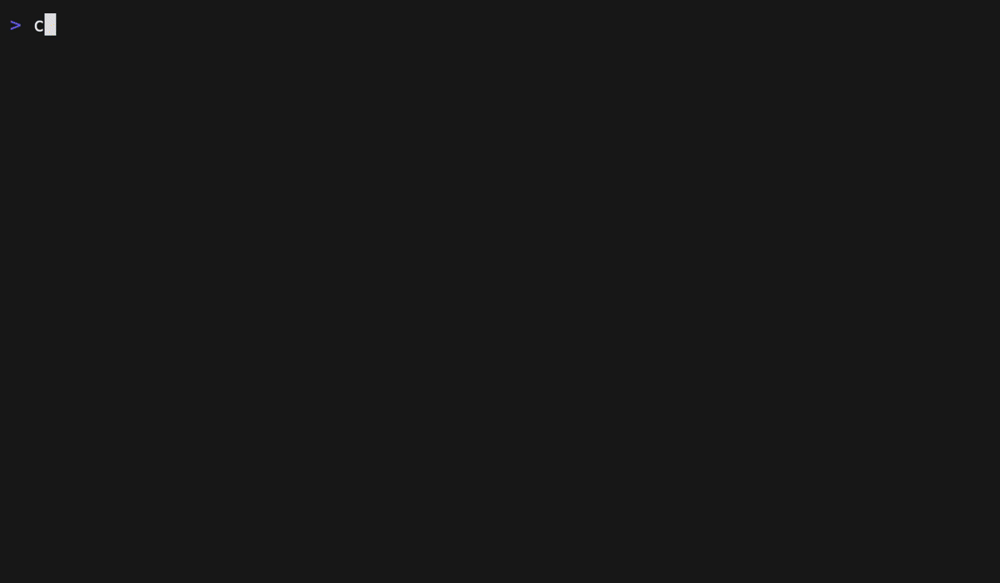

## A versatile widget list for Ratatui

<div align="center">
    
[](https://github.com/preiter93/tui-widget-list/actions/workflows/ci.yml)

</div>

This crate provides a stateful widget [`List`] implementation for `Ratatui`, enabling listing
widgets that implement the [`ListableWidget`] trait. The associated [`ListState`], offers functionalities
such as navigating to the next and previous items.
Additionally, the lists support both horizontal and vertical scrolling.

### Configuration
The [`List`] can be customized with the following options:
- `scroll_direction`: Specifies whether the list is vertically or horizontally scrollable.
- `style`: Defines the base style of the list.
- `block`: Optional outer block surrounding the list.
- `truncate`: Determines whether the first and last elements are truncated to fit the screen. Enabled by default.

You can adjust the behavior of [`ListState`] with the following options:
- `circular`: Determines if the selection is circular. When enabled, selecting the last item loops back to the first. Enabled by default.

### Example
```rust
use ratatui::buffer::Buffer;
use ratatui::layout::Rect;
use ratatui::style::{Color, Style, Stylize};
use ratatui::text::Text;
use ratatui::widgets::{Paragraph, Widget};
use ratatui::Frame;
use tui_widget_list::{List, ListState, ListableWidget, ScrollAxis};

#[derive(Debug, Clone)]
pub struct ListItem {
    text: String,
    style: Style,
    height: usize,
}

impl ListItem {
    pub fn new<T: Into<String>>(text: T, height: usize) -> Self {
        Self {
            text: text.into(),
            style: Style::default(),
            height,
        }
    }
}

impl ListableWidget for ListItem {
    fn size(&self, _: &ScrollAxis) -> usize {
        self.height
    }

    fn highlight(self) -> Self {
        Self {
            style: self.style.reversed(),
            ..self
        }
    }
}

impl Widget for ListItem {
    fn render(self, area: Rect, buf: &mut Buffer) {
        Paragraph::new(Text::from(self.text))
            .style(self.style)
            .render(area, buf);
    }
}

pub fn render(f: &mut Frame) {
    let list = List::new(vec![
        ListItem::new("hello", 1),
        ListItem::new("world", 2),
    ]);
    let mut state = ListState::default();
    f.render_stateful_widget(list, f.size(), &mut state);
}
```

For more examples see [tui-widget-list](https://github.com/preiter93/tui-widget-list/tree/main/examples).



License: MIT
